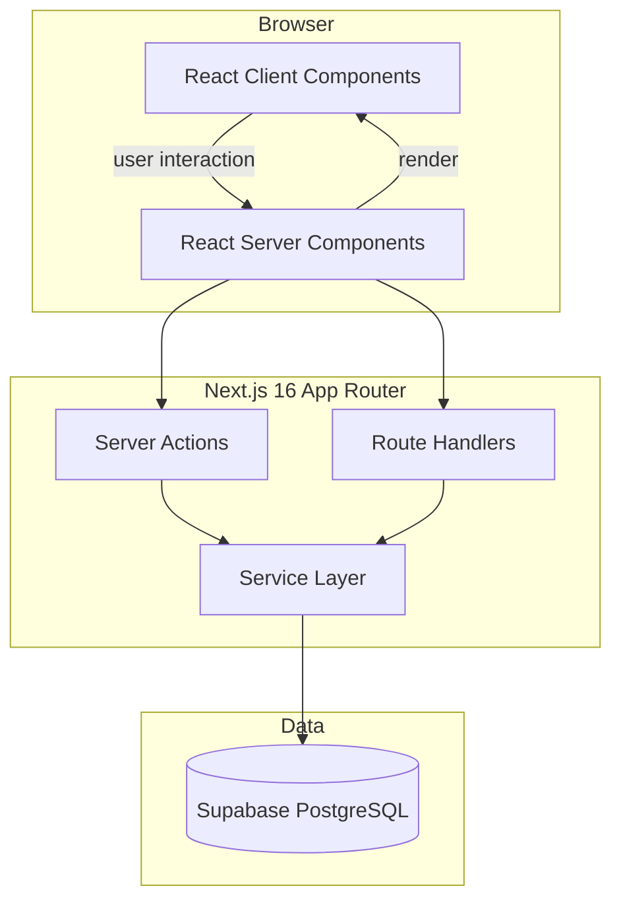
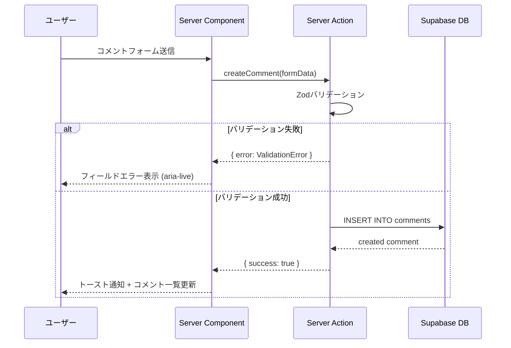
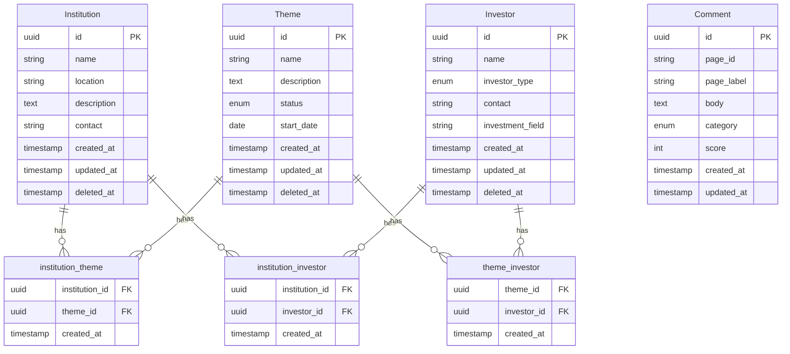

# Technical Design Document — Research Management Platform

## Overview

本機能は、研究機関・研究テーマ・投資家の管理と多対多関連付け、各画面へのコメント・レビュー投稿、集計ダッシュボードを提供するWebアプリケーションである。

**Purpose**: 研究エコシステムの参加者（機関・テーマ・投資家）を一元管理し、利用者がUIに対するフィードバックを登録・集計できる環境を提供する。

**Users**: 管理ユーザー（全機能）および一般ユーザー（閲覧・コメント投稿）が対象となる。

**Design System**: デジタル庁デザインシステム (DADS) β版 v2.11.1 に準拠する。詳細は `design-system/MASTER.md` および `.kiro/steering/design.md` を参照。

### Goals

- 研究機関・テーマ・投資家の CRUD と多対多関連付けを実現する
- 全管理画面にコメント・レビュー機能を組み込む
- DADS準拠のアクセシブルなUI（WCAG 2.1 AA）を提供する
- Next.js App Router + Server Actions によるシームレスなデータ操作を実現する

### Non-Goals

- 認証・認可システムの実装（本フェーズでは省略）
- リアルタイム通知・WebSocket連携
- i18n（日本語のみ対応）
- モバイルアプリ（PWA対応は任意）

---

## Architecture

### Architecture Pattern & Boundary Map



**Architecture Integration**:
- 選択パターン: Next.js App Router + Server Components + Server Actions
- Domain境界: UI層（components/）/ Service層（lib/services/）/ Data層（lib/db/）
- Server Componentsでデータ取得、Client Componentsでインタラクション、Server Actionsでミューテーション
- Steering準拠: TypeScript strict、型安全、`any` 禁止

### Technology Stack

| Layer | Choice / Version | Role in Feature | Notes |
|-------|------------------|-----------------|-------|
| Frontend | Next.js 16.2.1 + React 19 | App Router, Server Components, Server Actions | |
| Styling | Tailwind CSS v4 + DADS tokens | DADSデザイントークンを `@theme` でマッピング | `@digital-go-jp/design-tokens@1.1.9` |
| Font | Noto Sans JP (next/font/google) | DADS標準フォント | weight: 400, 700 |
| Icons | Heroicons v2 | SVGアイコン（絵文字禁止） | `@heroicons/react` |
| Charts | Recharts | コメント集計グラフ | Bar/Pie chart |
| Validation | Zod | フォームバリデーション、Server Actions入力検証 | |
| Data | Supabase (PostgreSQL) | CRUD、集計クエリ | `@supabase/supabase-js` |

---

## System Flows

### コメント投稿フロー



---

## Requirements Traceability

| Requirement | Summary | Components | Server Actions | Flows |
|-------------|---------|------------|----------------|-------|
| 1.1 | 研究機関登録 | InstitutionForm | createInstitution | — |
| 1.2 | 研究機関編集 | InstitutionForm | updateInstitution | — |
| 1.3 | 研究機関削除 | DeleteConfirmDialog | deleteInstitution | — |
| 1.4 | 研究機関一覧ソート | InstitutionTable | — | — |
| 1.5 | バリデーション | InstitutionForm | createInstitution (Zod) | — |
| 1.6 | 関連エンティティ表示 | InstitutionDetail | — | — |
| 2.1–2.6 | 研究テーマ管理 | Theme系コンポーネント | Theme系Actions | 1.1–1.6と同構造 |
| 3.1–3.6 | 投資家管理 | Investor系コンポーネント | Investor系Actions | 1.1–1.6と同構造 |
| 4.1 | 機関↔テーマ関連付け | AssociationPanel | associateTheme | — |
| 4.2 | 機関↔投資家関連付け | AssociationPanel | associateInvestor | — |
| 4.3 | 関連付け解除 | AssociationPanel | dissociate | — |
| 4.4 | 関連付けUI | AssociationPanel | — | — |
| 4.5 | 重複防止 | AssociationPanel | associate系 (DB UNIQUE) | — |
| 5.1 | コメントフォーム表示 | CommentSection | — | — |
| 5.2 | コメント保存 | CommentForm | createComment | コメント投稿フロー |
| 5.3 | 評価スコア | CommentForm | createComment | — |
| 5.4 | コメントバリデーション | CommentForm | createComment (Zod) | — |
| 5.5 | コメント一覧表示 | CommentList | — | — |
| 5.6 | コメント編集・削除 | CommentItem | updateComment, deleteComment | — |
| 6.1 | 集計ダッシュボード | DashboardPage | — | — |
| 6.2 | フィルタリング | DashboardFilter | — | — |
| 6.3 | 統計サマリー | StatsSummary | — | — |
| 6.4 | グラフ可視化 | CommentChart | — | — |
| 6.5 | コメント詳細 | CommentDetailModal | — | — |
| 6.6 | CSVエクスポート | ExportButton | exportComments | — |
| 7.1 | レスポンシブ | 全コンポーネント | — | — |
| 7.2 | ナビゲーション | Sidebar | — | — |
| 7.3 | 成功通知 | Toast | — | — |
| 7.4 | エラー表示 | ErrorBoundary | — | — |
| 7.5 | ローディング | Skeleton | — | — |
| 7.6 | 削除確認 | DeleteConfirmDialog | — | — |

---

## Components and Interfaces

### コンポーネントサマリー

| Component | Layer | Intent | Req Coverage | Key Dependencies |
|-----------|-------|--------|--------------|-----------------|
| Sidebar | UI/Layout | グローバルナビゲーション | 7.2 | next/link (P0) |
| InstitutionTable | UI/Data | 研究機関一覧・ソート | 1.4 | SortableHeader (P0) |
| InstitutionForm | UI/Form | 研究機関CRUD入力 | 1.1, 1.2, 1.5 | Zod, Server Action (P0) |
| ThemeForm | UI/Form | 研究テーマCRUD入力 | 2.1, 2.2, 2.5 | Zod, Server Action (P0) |
| InvestorForm | UI/Form | 投資家CRUD入力 | 3.1, 3.2, 3.5 | Zod, Server Action (P0) |
| AssociationPanel | UI/Association | 多対多関連付け管理 | 4.1–4.5 | Server Action (P0) |
| DeleteConfirmDialog | UI/Feedback | 削除確認モーダル | 1.3, 2.3, 3.3, 7.6 | — |
| CommentSection | UI/Comment | コメント一覧+投稿フォーム | 5.1, 5.5 | CommentForm, CommentList (P0) |
| CommentForm | UI/Form | コメント・レビュー投稿 | 5.2, 5.3, 5.4 | Zod, Server Action (P0) |
| DashboardPage | UI/Dashboard | 集計ダッシュボード画面 | 6.1–6.6 | Recharts, StatsSummary (P0) |
| Toast | UI/Feedback | 操作結果通知 | 7.3 | aria-live (P0) |
| Skeleton | UI/Loading | ローディング状態 | 7.5 | — |

---

### UI/Layout Layer

#### Sidebar

| Field | Detail |
|-------|--------|
| Intent | グローバルナビゲーション（研究機関・研究テーマ・投資家・コメント集計） |
| Requirements | 7.2 |

**Responsibilities & Constraints**
- 4つのナビゲーション項目を提供する
- 現在のルートに `aria-current="page"` を付与する
- モバイル（< 768px）ではハンバーガーボタンでトグル表示する

**Contracts**: State [ ✓ ]

```typescript
interface SidebarProps {
  currentPath: string;
}

type NavItem = {
  label: string;
  href: string;
  icon: React.ComponentType<React.SVGProps<SVGSVGElement>>;
};
```

**Implementation Notes**
- Integration: `next/link` の `usePathname` で active 判定
- Validation: なし
- Risks: モバイル時のアクセシビリティ（フォーカス管理）

---

### UI/Form Layer

#### InstitutionForm / ThemeForm / InvestorForm

3フォームは同一構造を持つ。`InstitutionForm` を代表として定義する。

| Field | Detail |
|-------|--------|
| Intent | 研究機関の新規登録・編集フォーム |
| Requirements | 1.1, 1.2, 1.5 |

**Responsibilities & Constraints**
- Server Actionを `action` プロパティに渡すフォームコンポーネントとして実装する
- Zodバリデーションエラーをフィールド直下に表示する
- 送信中はボタンをdisabledにしローディングインジケーターを表示する

**Dependencies**
- Inbound: Server Action（createInstitution / updateInstitution）— フォーム送信先 (P0)
- Outbound: Toast — 成功通知 (P1)

**Contracts**: Service [ ] / API [ ] / Event [ ] / Batch [ ] / State [ ✓ ]

##### State Management

```typescript
type FormState = {
  errors?: {
    name?: string[];
    location?: string[];
    description?: string[];
    contact?: string[];
  };
  message?: string;
  success?: boolean;
};
```

**Implementation Notes**
- Integration: `useActionState` (React 19) でServer Actionのレスポンスを受け取る
- Validation: Zod スキーマはServer Action内でのみ実行（クライアント側は `required` 属性のみ）
- Risks: `useActionState` はReact 19の新API、動作確認が必要

---

### UI/Association Layer

#### AssociationPanel

| Field | Detail |
|-------|--------|
| Intent | エンティティ詳細画面で関連付けの追加・解除を行うパネル |
| Requirements | 4.1, 4.2, 4.3, 4.4, 4.5 |

**Responsibilities & Constraints**
- 関連付け済みエンティティの一覧表示と解除ボタンを提供する
- 未関連エンティティを検索・選択して関連付けるUIを提供する
- DB側の UNIQUE 制約と連携して重複登録を防ぐ

**Contracts**: Service [ ] / API [ ] / Event [ ] / Batch [ ] / State [ ✓ ]

```typescript
interface AssociationPanelProps {
  sourceType: 'institution' | 'theme' | 'investor';
  sourceId: string;
  targetType: 'institution' | 'theme' | 'investor';
  associated: Array<{ id: string; name: string }>;
  available: Array<{ id: string; name: string }>;
  onAssociate: (targetId: string) => Promise<void>;
  onDissociate: (targetId: string) => Promise<void>;
}
```

---

### UI/Comment Layer

#### CommentForm

| Field | Detail |
|-------|--------|
| Intent | 各管理画面へのコメント・レビュー投稿フォーム |
| Requirements | 5.2, 5.3, 5.4 |

**Contracts**: State [ ✓ ]

```typescript
type CommentCategory = 'improvement' | 'bug' | 'other';

interface CommentFormProps {
  pageId: string;      // 対象画面識別子（例: "institutions/list"）
  pageLabel: string;   // 表示用ラベル
}

type CommentFormState = {
  errors?: {
    body?: string[];
    category?: string[];
    score?: string[];
  };
  success?: boolean;
};
```

**Implementation Notes**
- Integration: `pageId` を hidden input として送信し、Server Action でコメントと紐付ける
- Validation: `body` は必須・最大1000文字、`score` は 1〜5 の整数
- Risks: なし

---

### UI/Dashboard Layer

#### DashboardPage

| Field | Detail |
|-------|--------|
| Intent | 全コメントの集計・フィルタリング・可視化・CSVエクスポート |
| Requirements | 6.1, 6.2, 6.3, 6.4, 6.5, 6.6 |

**Contracts**: State [ ✓ ]

**依存コンポーネント**
- `DashboardFilter`: 対象画面・種別・日付範囲フィルター (P0)
- `StatsSummary`: 画面別件数・平均スコア表示 (P0)
- `CommentChart`: Rechartsによる棒グラフ・円グラフ (P0)
- `CommentTable`: 全コメント一覧テーブル (P0)
- `CommentDetailModal`: 詳細表示モーダル (P1)
- `ExportButton`: CSV生成・ダウンロード (P1)

**Implementation Notes**
- Integration: フィルター状態はURLクエリパラメーターで管理（Deep Link対応）
- Validation: 日付範囲は開始日 ≤ 終了日 を検証
- Risks: 大量コメント時のパフォーマンス → ページネーション必須

---

### Service/Data Layer

#### Server Actions

**Contracts**: Service [ ✓ ]

```typescript
// 研究機関
interface InstitutionActions {
  createInstitution(formData: FormData): Promise<ActionResult<Institution>>;
  updateInstitution(id: string, formData: FormData): Promise<ActionResult<Institution>>;
  deleteInstitution(id: string): Promise<ActionResult<void>>;
}

// 研究テーマ
interface ThemeActions {
  createTheme(formData: FormData): Promise<ActionResult<Theme>>;
  updateTheme(id: string, formData: FormData): Promise<ActionResult<Theme>>;
  deleteTheme(id: string): Promise<ActionResult<void>>;
}

// 投資家
interface InvestorActions {
  createInvestor(formData: FormData): Promise<ActionResult<Investor>>;
  updateInvestor(id: string, formData: FormData): Promise<ActionResult<Investor>>;
  deleteInvestor(id: string): Promise<ActionResult<void>>;
}

// 関連付け
interface AssociationActions {
  associate(sourceType: EntityType, sourceId: string, targetType: EntityType, targetId: string): Promise<ActionResult<void>>;
  dissociate(sourceType: EntityType, sourceId: string, targetType: EntityType, targetId: string): Promise<ActionResult<void>>;
}

// コメント
interface CommentActions {
  createComment(formData: FormData): Promise<ActionResult<Comment>>;
  updateComment(id: string, formData: FormData): Promise<ActionResult<Comment>>;
  deleteComment(id: string): Promise<ActionResult<void>>;
  exportComments(filters: CommentFilters): Promise<ActionResult<Blob>>;
}

type ActionResult<T> =
  | { success: true; data: T }
  | { success: false; errors: Record<string, string[]>; message?: string };
```

- Preconditions: 全Actionは入力をZodスキーマで検証してから実行する
- Postconditions: 成功時は `revalidatePath` でキャッシュを無効化する
- Invariants: DB操作はSupabase clientをサーバーサイドのみで使用する

---

## Data Models

### Domain Model



### Physical Data Model

```sql
-- 研究機関
CREATE TABLE institutions (
  id          UUID PRIMARY KEY DEFAULT gen_random_uuid(),
  name        TEXT NOT NULL,
  location    TEXT,
  description TEXT,
  contact     TEXT,
  created_at  TIMESTAMPTZ NOT NULL DEFAULT now(),
  updated_at  TIMESTAMPTZ NOT NULL DEFAULT now(),
  deleted_at  TIMESTAMPTZ
);
CREATE INDEX idx_institutions_deleted_at ON institutions(deleted_at);
CREATE INDEX idx_institutions_name ON institutions(name) WHERE deleted_at IS NULL;

-- 研究テーマ
CREATE TABLE themes (
  id          UUID PRIMARY KEY DEFAULT gen_random_uuid(),
  name        TEXT NOT NULL,
  description TEXT,
  status      TEXT NOT NULL CHECK (status IN ('active', 'completed', 'pending')),
  start_date  DATE,
  created_at  TIMESTAMPTZ NOT NULL DEFAULT now(),
  updated_at  TIMESTAMPTZ NOT NULL DEFAULT now(),
  deleted_at  TIMESTAMPTZ
);

-- 投資家
CREATE TABLE investors (
  id               UUID PRIMARY KEY DEFAULT gen_random_uuid(),
  name             TEXT NOT NULL,
  investor_type    TEXT NOT NULL CHECK (investor_type IN ('individual', 'corporate')),
  contact          TEXT,
  investment_field TEXT,
  created_at       TIMESTAMPTZ NOT NULL DEFAULT now(),
  updated_at       TIMESTAMPTZ NOT NULL DEFAULT now(),
  deleted_at       TIMESTAMPTZ
);

-- 関連付けテーブル（重複防止: UNIQUE制約）
CREATE TABLE institution_theme (
  institution_id UUID NOT NULL REFERENCES institutions(id),
  theme_id       UUID NOT NULL REFERENCES themes(id),
  created_at     TIMESTAMPTZ NOT NULL DEFAULT now(),
  PRIMARY KEY (institution_id, theme_id)
);

CREATE TABLE institution_investor (
  institution_id UUID NOT NULL REFERENCES institutions(id),
  investor_id    UUID NOT NULL REFERENCES investors(id),
  created_at     TIMESTAMPTZ NOT NULL DEFAULT now(),
  PRIMARY KEY (institution_id, investor_id)
);

CREATE TABLE theme_investor (
  theme_id    UUID NOT NULL REFERENCES themes(id),
  investor_id UUID NOT NULL REFERENCES investors(id),
  created_at  TIMESTAMPTZ NOT NULL DEFAULT now(),
  PRIMARY KEY (theme_id, investor_id)
);

-- コメント
CREATE TABLE comments (
  id          UUID PRIMARY KEY DEFAULT gen_random_uuid(),
  page_id     TEXT NOT NULL,   -- 例: "institutions/list", "themes/detail/xxx"
  page_label  TEXT NOT NULL,
  body        TEXT NOT NULL CHECK (char_length(body) <= 1000),
  category    TEXT NOT NULL CHECK (category IN ('improvement', 'bug', 'other')),
  score       INT CHECK (score BETWEEN 1 AND 5),
  created_at  TIMESTAMPTZ NOT NULL DEFAULT now(),
  updated_at  TIMESTAMPTZ NOT NULL DEFAULT now()
);
CREATE INDEX idx_comments_page_id ON comments(page_id);
CREATE INDEX idx_comments_created_at ON comments(created_at DESC);
```

### Data Contracts & Integration

**TypeScript ドメイン型**

```typescript
type ThemeStatus = 'active' | 'completed' | 'pending';
type InvestorType = 'individual' | 'corporate';
type CommentCategory = 'improvement' | 'bug' | 'other';

interface Institution {
  id: string;
  name: string;
  location: string | null;
  description: string | null;
  contact: string | null;
  createdAt: Date;
  updatedAt: Date;
}

interface Theme {
  id: string;
  name: string;
  description: string | null;
  status: ThemeStatus;
  startDate: string | null;
  createdAt: Date;
  updatedAt: Date;
}

interface Investor {
  id: string;
  name: string;
  investorType: InvestorType;
  contact: string | null;
  investmentField: string | null;
  createdAt: Date;
  updatedAt: Date;
}

interface Comment {
  id: string;
  pageId: string;
  pageLabel: string;
  body: string;
  category: CommentCategory;
  score: number | null;
  createdAt: Date;
  updatedAt: Date;
}

interface CommentFilters {
  pageId?: string;
  category?: CommentCategory;
  dateFrom?: string;
  dateTo?: string;
  page?: number;
  limit?: number;
}
```

**Zodバリデーションスキーマ例**

```typescript
import { z } from 'zod';

const institutionSchema = z.object({
  name: z.string().min(1, '機関名は必須です').max(200),
  location: z.string().max(200).optional(),
  description: z.string().max(2000).optional(),
  contact: z.string().max(200).optional(),
});

const commentSchema = z.object({
  pageId: z.string().min(1),
  pageLabel: z.string().min(1),
  body: z.string().min(1, 'コメントを入力してください').max(1000),
  category: z.enum(['improvement', 'bug', 'other']),
  score: z.coerce.number().int().min(1).max(5).optional(),
});
```

---

## Error Handling

### Error Strategy

Server Actions は `ActionResult<T>` 型でエラーを返し、クライアントはこれを元にUIを更新する。

### Error Categories and Responses

**User Errors (バリデーション)**
- Zodエラー → フィールド直下に `text-error` クラスのエラーメッセージを表示
- `aria-live="polite"` でスクリーンリーダーに通知
- 送信失敗後は最初のエラーフィールドにフォーカスを移動する

**System Errors (5xx)**
- Supabase接続エラー → "システムエラーが発生しました。しばらく後に再試行してください" を表示
- `<ErrorBoundary>` でキャッチし、Retry ボタンを提供する

**Business Logic Errors**
- 重複関連付け（UNIQUE違反）→ "この関連付けはすでに存在します" を表示
- 論理削除済みエンティティの操作 → 404ページにリダイレクト

### Monitoring

- Server Actions内でconsole.errorの代わりに適切なロガーを使用する（production環境）
- エラー発生時はHTTPステータスコードとエラー種別をログに記録する

---

## Testing Strategy

### Unit Tests

- `institutionSchema.parse()` / `commentSchema.parse()` のZodバリデーションパターン（正常系・異常系）
- `ActionResult` 型のヘルパー関数
- コメント集計ロジック（pageId別グループ化、平均スコア計算）

### Integration Tests

- Server Actions: createInstitution → DB INSERT → revalidatePath の確認
- AssociationActions: 重複登録時の UNIQUE 制約エラーハンドリング
- CommentActions: フィルタークエリの結果検証

### E2E Tests (Playwright)

- 研究機関の登録 → 一覧確認 → 編集 → 削除フロー
- 関連付けパネルで研究テーマを追加・解除するフロー
- コメント投稿 → 集計ダッシュボードでの確認フロー
- バリデーションエラー表示の確認

---

## Security Considerations

- Supabase クライアントはサーバーサイドのみで使用する（クライアントコンポーネントへの漏洩禁止）
- Server Actions への入力は必ず Zod でバリデーションする
- SQLインジェクション: Supabaseのパラメーター化クエリを使用する
- XSS: `dangerouslySetInnerHTML` を使用しない

---

## Performance & Scalability

- Server Componentsでのデータ取得は `unstable_cache` または `revalidatePath` を活用する
- コメント一覧はページネーション（デフォルト20件/ページ）を実装する
- 集計クエリはDBでGROUP BYを実行し、アプリケーション層での集計を最小化する
- 大量データ向け: コメントテーブルに `page_id` と `created_at` のインデックスを作成済み

---

## Supporting References

- [design-system/MASTER.md](../../../../design-system/MASTER.md) — DADS Tailwind v4 統合設定
- [.kiro/steering/design.md](../../steering/design.md) — DADSデザイントークン一覧
- [research.md](./research.md) — Tailwind v4統合方法・パッケージ調査結果
